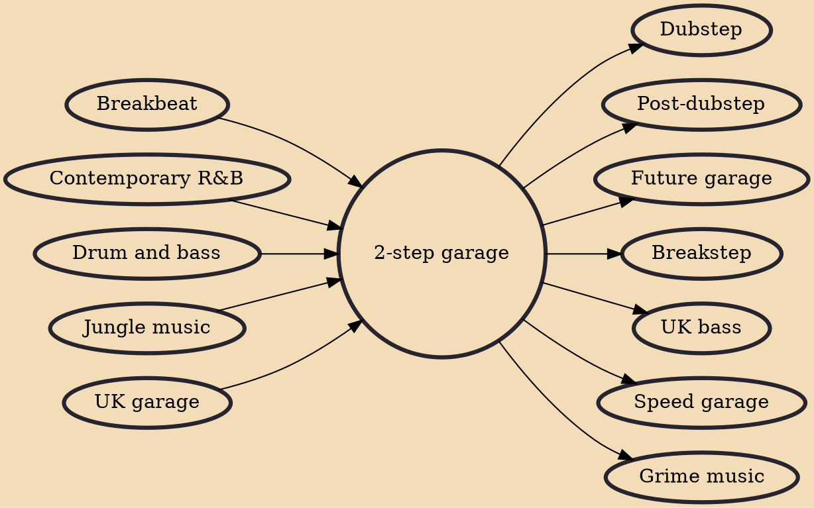

2-step garage, or simply 2-step, is a genre of electronic music and a subgenre of UK garage. One of the primary characteristics of the 2-step sound – the term being coined to describe "a general rubric for all kinds of jittery, irregular rhythms that don't conform to garage's traditional four-on-the-floor pulse" – is that the rhythm lacks the kick drum pattern found in many other styles of electronic music with a regular four-on-the-floor beat.

## Influences

- [[Breakbeat]]
- [[Contemporary R&B]]
- [[Drum and bass]]
- [[Jungle music]]
- [[UK garage]]

## Derivatives

- [[Dubstep]]
- [[Post-dubstep]]
- [[Future garage]]
- [[Breakstep]]
- [[UK bass]]
- [[Speed garage]]
- [[Grime music]]
