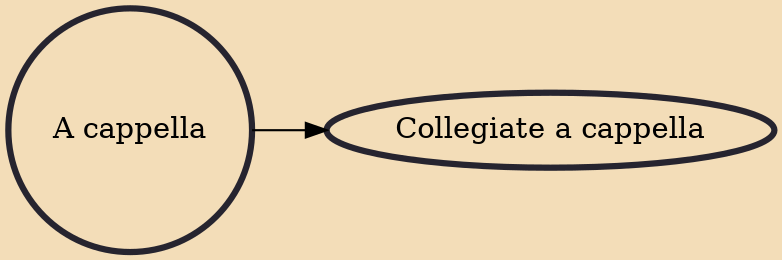

A cappella (/ˌɑː kəˈpɛlə/, also UK: /ˌæ -/, Italian: [a kkapˈpɛlla]; Italian for ''in the style of the chapel'') music is a performance by a singer or a singing group without instrumental accompaniment, or a piece intended to be performed in this way. The term a cappella was originally intended to differentiate between Renaissance polyphony and Baroque concertato musical styles. In the 19th century, a renewed interest in Renaissance polyphony, coupled with an ignorance of the fact that vocal parts were often doubled by instrumentalists, led to the term coming to mean unaccompanied vocal music. The term is also used, rarely, as a synonym for alla breve.

## Derivatives

- [[Collegiate a cappella]]
