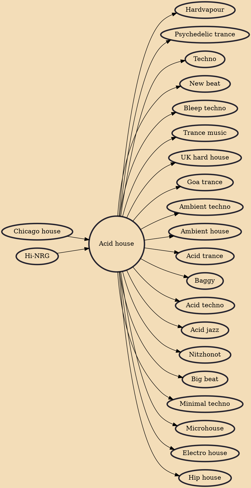

Acid house (also simply known as just "acid") is a subgenre of house music developed around the mid-1980s by DJs from Chicago. The style is defined primarily by the squelching sounds and basslines of the Roland TB-303 electronic bass synthesizer-sequencer, an innovation attributed to Chicago producers DJ Pierre of Phuture and Sleezy D. Acid house brought house music to a worldwide audience. The influence of acid house can be heard in later styles of dance music including trance, hardcore, jungle, big beat, techno and trip hop.

## Influences
- [[Chicago house]]
- [[Hi-NRG]]

## Derivatives
- [[Hardvapour]]
- [[Psychedelic trance]]
- [[Techno]]
- [[New beat]]
- [[Bleep techno]]
- [[Trance music]]
- [[UK hard house]]
- [[Goa trance]]
- [[Ambient techno]]
- [[Ambient house]]
- [[Acid trance]]
- [[Baggy]]
- [[Acid techno]]
- [[Acid jazz]]
- [[Nitzhonot]]
- [[Big beat]]
- [[Minimal techno]]
- [[Microhouse]]
- [[Electro house]]
- [[Hip house]]
