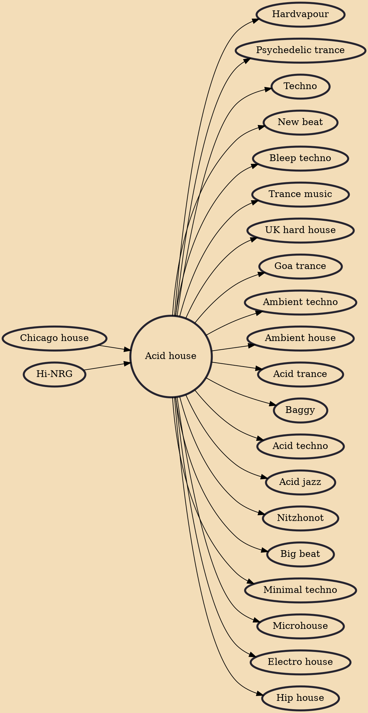

Emerging from the warehouses and clubs of Chicago and later making its way across the Atlantic to the UK, Acid House (also sometimes just called "Acid") originated from the experimentation with the Roland TB-303 synthesizer. Initially intended for creating basslines, this machine inadvertently birthed the genre's signature squelchy and otherworldly sound, akin to a musical acid trip.

Acid House isn't merely a genre; it's a cultural phenomenon that challenged conventions and brought forth a new era of electronic music. Its squelchy basslines and mind-bending sounds captured the imagination of a generation and continue to influence artists across genres today. Acid House's legacy extends far beyond its sonic impact, as it catalyzed a subculture that championed unity, inclusivity, and the pursuit of ecstatic experiences. As you delve into the world of Acid House, be prepared to embark on a sonic journey that transcends time and space.

## Key Characteristics

Acid House is defined by a set of unique characteristics:

1. 303 Basslines: The Roland TB-303's distinctive basslines are the heart and soul of Acid House. These squelchy, resonant, and often unpredictable sequences became the genre's sonic identity.
2. Repetitive Patterns: Acid House tracks are known for their hypnotic repetition, creating a trance-like state that draws listeners into a deep, rhythmic groove.
3. 4/4 Beats: Like its predecessors in the dance music world, Acid House retains the driving 4/4 beat, encouraging dance and movement.
4. Psychedelic Aesthetics: Both the music and the culture surrounding Acid House are characterized by their psychedelic influences, visually and sonically.
5. Revolution of Raves: Acid House parties and raves played a crucial role in the genre's cultural impact, fostering a sense of community, rebellion, and uninhibited expression.

## Artists and Tracks

1. [Phuture](https://amzn.to/3EgtbIM) - "Acid Tracks": Widely considered the first Acid House track, Phuture's "Acid Tracks" (1987) introduced the world to the TB-303's hypnotic potential.
2. [Josh Wink](https://www.amazon.co.uk/music/player/artists/B001E6VZY4/josh-wink?&linkCode=ll2&tag=rossle-21&linkId=18ef0156bb0350eff44c4e70ca404741&language=en_GB&ref_=as_li_ss_tl) - "Higher State of Consciousness": Released in the 1990s, this track captured the essence of Acid House's mind-altering journey, blending acid squelches with pulsating beats.
3. [808 State](https://www.amazon.co.uk/music/player/artists/B001E6U4GY/808-state?qid=1693243704&sr=8-1&isDramIntegrated=true&shoppingPortalEnabled=true&linkCode=ll2&tag=rossle-21&linkId=5cc68f60e76928524a231dbc01c20cde&language=en_GB&ref_=as_li_ss_tl) - "Pacific State": While not as intense as other Acid House tracks, "Pacific State" (1989) by 808 State infuses the genre's energy with a mellow, dreamy atmosphere.
4. [The KLF](https://www.amazon.co.uk/music/player/artists/B00GPH8O46/the-klf?&linkCode=ll2&tag=rossle-21&linkId=c7c3bbf22fe608da3564505a478b3459&language=en_GB&ref_=as_li_ss_tl) - "What Time Is Love?": The KLF's fusion of Acid House with pop sensibilities in "What Time Is Love?" (1988) exemplified the genre's versatility.
5. [Hardfloor](https://www.amazon.co.uk/music/player/artists/B001EUK7JE/hardfloor?&linkCode=ll2&tag=rossle-21&linkId=11e8f8586363638a958883dba5fa3025&language=en_GB&ref_=as_li_ss_tl) - "Acperience 1": Known for their innovative approach to Acid House, Hardfloor's "Acperience 1" (1992) pushed the boundaries of the genre's sonic palette.
6. [Armando](https://www.amazon.co.uk/music/player/artists/B001E3I9G4/armando?&linkCode=ll2&tag=rossle-21&linkId=f46beb80f4ae599c421f1980920e6409&language=en_GB&ref_=as_li_ss_tl) - "100% of Disin' You": Armando's track (1988) is an exhilarating journey through the Acid House landscape, showcasing the raw energy and intensity of the genre.
## Influences
- [[Chicago house]]
- [[Hi-NRG]]

## Derivatives
- [[Hardvapour]]
- [[Psychedelic trance]]
- [[Techno]]
- [[New beat]]
- [[Bleep techno]]
- [[Trance music]]
- [[UK hard house]]
- [[Goa trance]]
- [[Ambient techno]]
- [[Ambient house]]
- [[Acid trance]]
- [[Baggy]]
- [[Acid techno]]
- [[Acid jazz]]
- [[Nitzhonot]]
- [[Big beat]]
- [[Minimal techno]]
- [[Microhouse]]
- [[Electro house]]
- [[Hip house]]
