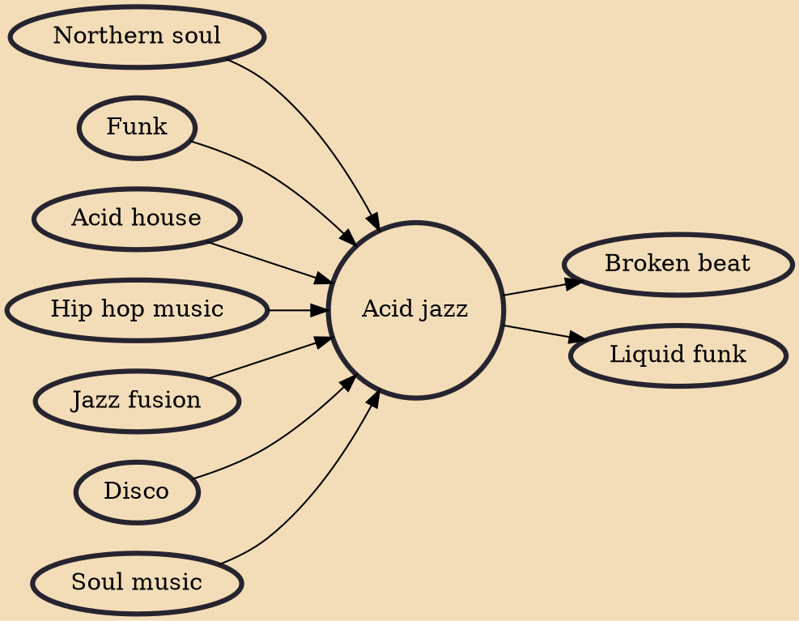

Acid jazz (also known as club jazz, psychedelic jazz, or groove jazz) is a music genre that combines elements of funk, soul, and hip hop, as well as jazz and disco. Acid jazz originated in clubs in London during the 1980s with the rare groove movement and spread to the United States, Japan, Eastern Europe, and Brazil. Acts included The Brand New Heavies, D'Influence, Incognito, Us3, and Jamiroquai from the UK and Buckshot LeFonque and Digable Planets from the U.S. The rise of electronic club music in the middle to late 1990s led to a decline in interest, and in the twenty-first century, the movement became indistinct as a genre. Many acts that might have been defined as acid jazz are seen as jazz-funk, neo soul, or jazz rap.

## Influences
- [[Northern soul]]
- [[Funk]]
- [[Acid house]]
- [[Hip hop music]]
- [[Jazz fusion]]
- [[Disco]]
- [[Soul music]]

## Derivatives
- [[Broken beat]]
- [[Liquid funk]]
