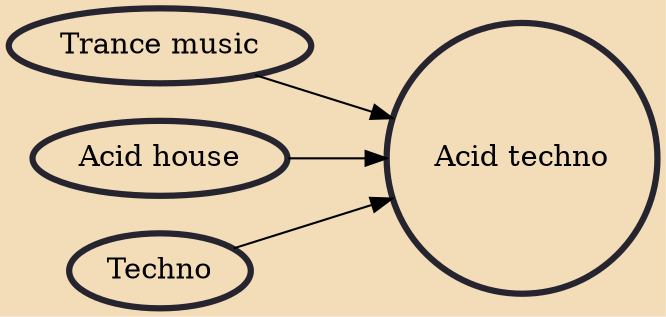

Acid techno, sometimes known generally as "acid", is a genre of techno that was derived from acid house and developed in Europe in the late 1980s to early 1990s. It saw younger artists apply the "squelching" synthesizer sound of Chicago acid house to harder-edged techno material.

## Influences

- [[Trance music]]
- [[Acid house]]
- [[Techno]]
