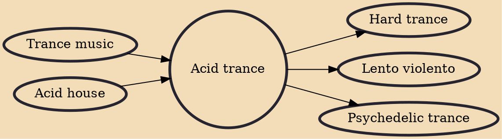

Acid trance is a genre of trance music that emerged in the early 1990s focusing on using the acid sound. The trademark sound of "acid" is produced with a Roland TB-303 by playing a sequenced melody while altering the instrument's filter cutoff frequency, resonance, envelope modulation, and accent controls. This real-time tone adjustment was not part of the instrument's original intended operation. Acid trance is the best known form of trance music in Belgium. The form was first showcased at the popular Antwerp Rave 24 in Belgium, and has created four national number one singles in the country since.

## Influences

- [[Trance music]]
- [[Acid house]]

## Derivatives

- [[Hard trance]]
- [[Lento violento]]
- [[Psychedelic trance]]
