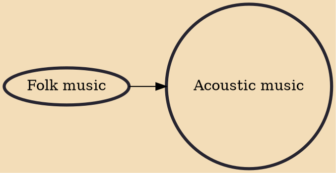

Acoustic music is music that solely or primarily uses instruments that produce sound through acoustic means, as opposed to electric or electronic means. While all music was once acoustic, the retronym "acoustic music" appeared after the advent of electric instruments, such as the electric guitar, electric violin, electric organ and synthesizer. Acoustic string instrumentations had long been a subset of popular music, particularly in folk. It stood in contrast to various other types of music in various eras, including big band music in the pre-rock era, and electric music in the rock era.

## Influences
- [[Folk music]]
