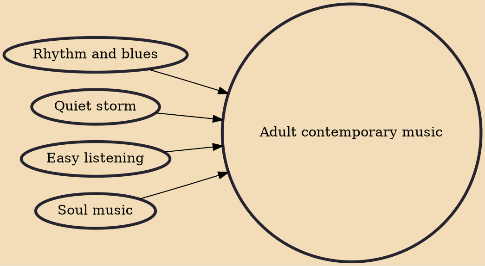

Adult contemporary music (AC) is a form of radio-played popular music, ranging from 1960s vocal and 1970s soft rock music to predominantly ballad-heavy music of the present day, with varying degrees of easy listening, pop, soul, R&B, quiet storm and rock influence. Adult contemporary is generally a continuation of the easy listening and soft rock style that became popular in the 1960s and 1970s with some adjustments that reflect the evolution of pop/rock music.

## Influences
- [[Rhythm and blues]]
- [[Quiet storm]]
- [[Easy listening]]
- [[Soul music]]
