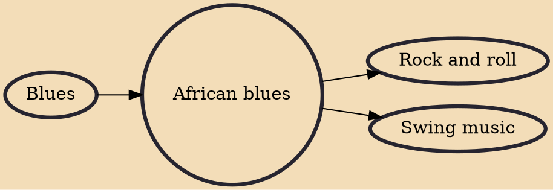

African blues is a genre of popular music, primarily from West Africa. The term may also reference a putative journey undertaken by traditional African music from its homeland to the United States and back. Some scholars and ethnomusicologists have speculated that the origins of the blues can be traced to the musical traditions of Africa, as retained by African-Americans during and after slavery. Even though the blues is a key component of American popular music, its rural, African-American origins are largely undocumented, and its stylistic links with African instrumental traditions are somewhat tenuous. One musical influence that can be traced back to African sources is that of the plantation work songs with their call-and-response format, and more especially the relatively free-form fie

## Influences

- [[Blues]]

## Derivatives

- [[Rock and roll]]
- [[Swing music]]
