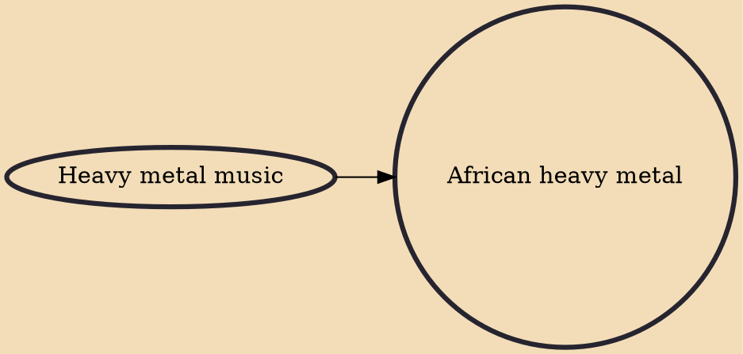

African heavy metal refers to the heavy metal music scene in Africa, particularly in East African countries such as Kenya and Uganda, and Southern African countries including Namibia, Madagascar, Angola, Botswana, South Africa, Mozambique, and Zimbabwe. It also extends into North African nations such as Algeria, Egypt, Libya, Morocco, and Tunisia, although bands in the North African region associate themselves more closely with the MENA region in terms of cultural and social consistencies. African heavy metal is characterized by the use of European and American metal genres, usually blended with traditional African instruments and musical styles, creating distinct regional differences.

## Influences

- [[Heavy metal music]]
