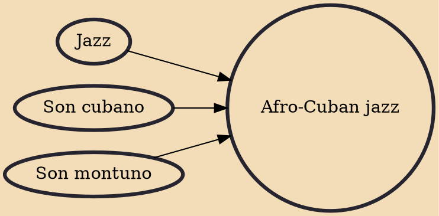

Afro-Cuban jazz is the earliest form of Latin jazz. It mixes Afro-Cuban clave-based rhythms with jazz harmonies and techniques of improvisation. Afro-Cuban music has deep roots in African ritual and rhythm. Afro-Cuban jazz emerged in the early 1940s with the Cuban musicians Mario Bauzá and Frank Grillo "Machito" in the band Machito and his Afro-Cubans in New York City. In 1947, the collaborations of bebop trumpeter Dizzy Gillespie and percussionist Chano Pozo brought Afro-Cuban rhythms and instruments, such as the tumbadora and the bongo, into the East Coast jazz scene. Early combinations of jazz with Cuban music, such as "Manteca" and "Mangó Mangüé", were commonly referred to as "Cubop" for Cuban bebop.

## Influences

- [[Jazz]]
- [[Son cubano]]
- [[Son montuno]]
