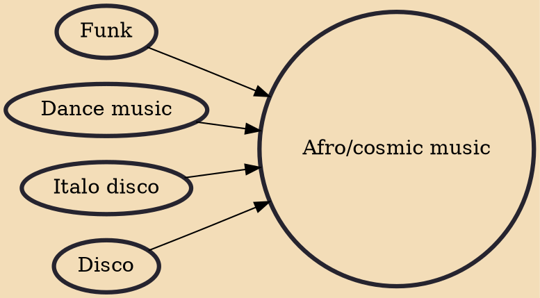

In music, the terms Afro/cosmic disco, the cosmic sound, free-style sound, and combinations thereof (Afro, cosmic Afro, Afro-cosmic, Afro-freestyle, etc., as well as Afro-funky) are used somewhat interchangeably to describe various forms of synthesizer-heavy and/or African-influenced dance music and methods of DJing that were originally developed and promoted by a small number of DJs in certain discothèques of Northern Italy from the late 1970s through the mid-1980s. The terms slow-motion disco and Elettronica Meccanica are also associated with the genre.

## Influences

- [[Funk]]
- [[Dance music]]
- [[Italo disco]]
- [[Disco]]
