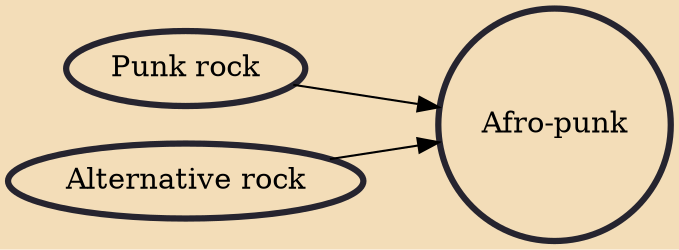

Afro-punk (sometimes spelled Afro-Punk, Afropunk or AfroPunk) refers to the participation of African Americans and other Black people in punk and alternative subcultures, especially in the United States.

## Influences
- [[Punk rock]]
- [[Alternative rock]]
