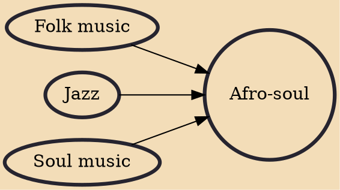

Afro-soul is a music genre that has African characteristics of soul music. It has emotional vocals, especially of the lead singer. There is a very strong link between Afro-soul and other genres like Afro-Jazz, Amapiano, and Afrobeats.

## Influences
- [[Folk music]]
- [[Jazz]]
- [[Soul music]]
