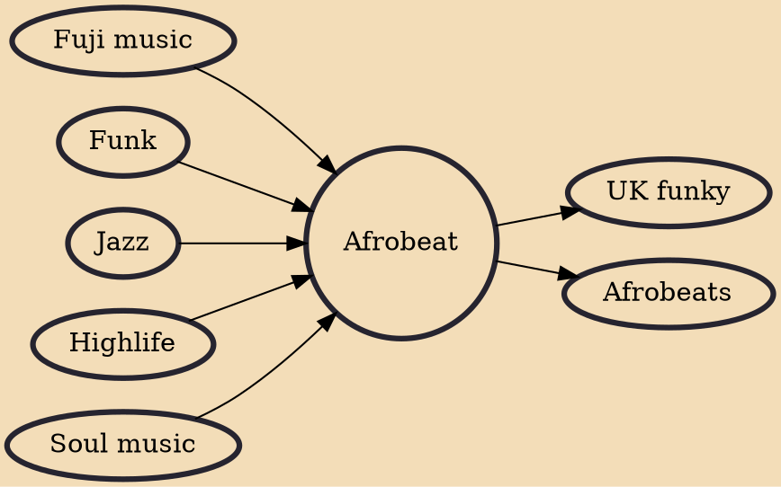

Afrobeat is a Nigerian music genre that involves the combination of West African musical styles (such as traditional Yoruba music and highlife) and American funk, jazz, and soul influences, with a focus on chanted vocals, complex intersecting rhythms, and percussion. The style was pioneered in the 1960s by Nigerian multi-instrumentalist and bandleader Fela Kuti, who is responsible for popularizing the style both within and outside Nigeria.

## Influences

- [[Fuji music]]
- [[Funk]]
- [[Jazz]]
- [[Highlife]]
- [[Soul music]]

## Derivatives

- [[UK funky]]
- [[Afrobeats]]
