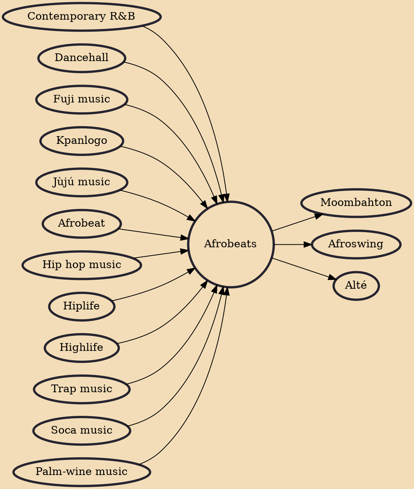

Afrobeats (not to be confused with Afrobeat or Afroswing), or Afro-pop or Afro-fusion (or Afropop or Afrofusion), is an umbrella term to describe popular music from West Africa and the diaspora that initially developed in Nigeria, Ghana, and the UK in the 2000s and 2010s. Afrobeats is less of a style per se, and more of a descriptor for the fusion of sounds flowing out of Ghana and Nigeria. Genres such as hiplife, jùjú music, highlife and naija beats, among others, were amalgamated under the 'Afrobeats' umbrella.

## Influences
- [[Contemporary R&B]]
- [[Dancehall]]
- [[Fuji music]]
- [[Kpanlogo]]
- [[Jùjú music]]
- [[Afrobeat]]
- [[Hip hop music]]
- [[Hiplife]]
- [[Highlife]]
- [[Trap music]]
- [[Soca music]]
- [[Palm-wine music]]

## Derivatives
- [[Moombahton]]
- [[Afroswing]]
- [[Alté]]
