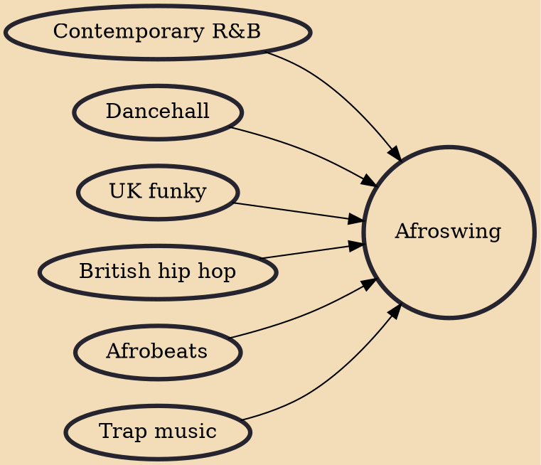

Afroswing, also known as Afrobashment, or less commonly Afrobbean or Afro-trap (not to be confused with the French genre), is a genre of music that developed in the UK during the mid-2010s, derivative of dancehall and afrobeats, with influences from trap, hip hop, R&B, and grime. Commercially, the genre has been very successful, with many afroswing artists making it into the British charts.

## Influences

- [[Contemporary R&B]]
- [[Dancehall]]
- [[UK funky]]
- [[British hip hop]]
- [[Afrobeats]]
- [[Trap music]]
