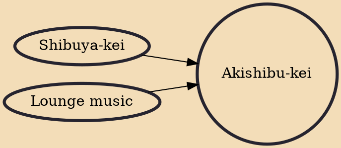

Akishibu-kei (Japanese: アキシブ系, lit. "Akihabara-Shibuya style") is a loosely defined trend from the 2000s that involved an increase of Shibuya-kei influence in anime soundtracks. The term is a portmanteau of "Shibuya-kei" and "Akiba-kei". Both were 1990s cultural movements associated with musical and otaku interests, respectively, and Akishibu-kei was thought to have represented a merging of the two.

## Influences

- [[Shibuya-kei]]
- [[Lounge music]]
