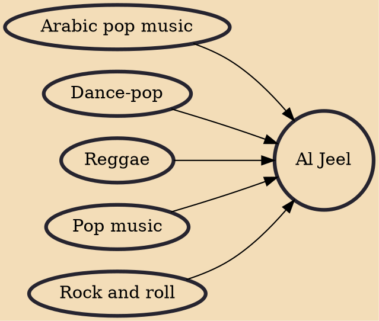

Al Jeel, also known as Jeel, Geel (Egyptian Arabic), is an Egyptian alternative to foreign popular forms of music that developed in the 1970s. Modeled after foreign rock and roll and pop music, Al Jeel became oriented around dance/pop, and had a background similar to reggae. Al Jeel also included many distinctively Egyptian characteristics, somewhat related to past Egyptian musical influences. One of the most famous Al Jeel performers is Hamid El Shaeri.

## Influences

- [[Arabic pop music]]
- [[Dance-pop]]
- [[Reggae]]
- [[Pop music]]
- [[Rock and roll]]
