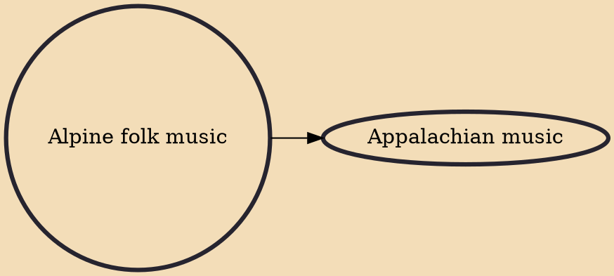

Alpine folk music (German: Alpenländische Volksmusik; German's Volksmusik means "people's music" or as a Germanic connotative translation, "folk's music") is the common umbrella designation of a number of related styles of traditional folk music of the Germanosphere, particularly in the Alpine regions of Slovenia, Northern Croatia, Germany, Austria, Switzerland and South Tyrol (Italy). It tends to be dialect-heavy and invokes local and regional lifestyles, cultures and traditions, particularly, those of the Alpine farmers and peasants.

## Derivatives

- [[Appalachian music]]
