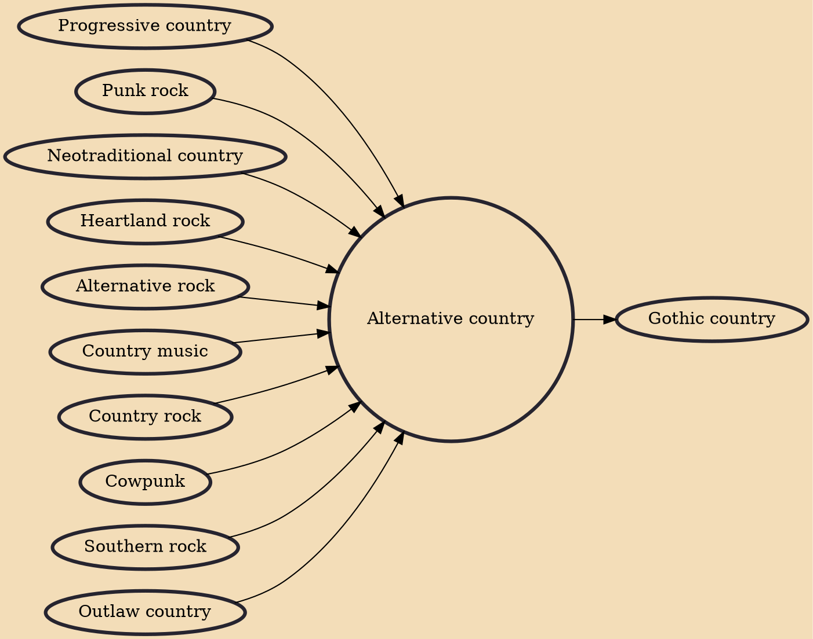

Alternative country, or alternative country rock (sometimes alt-country, insurgent country, Americana, or y'allternative), is a loosely defined subgenre of country music and/or country rock that includes acts that differ significantly in style from mainstream country music, mainstream country rock, and country pop. Alternative country artists are often influenced by alternative rock. Most frequently, the term has been used to describe certain country music and country rock bands and artists that are also defined as or have incorporated influences from alternative rock, heartland rock, Southern rock, progressive country, outlaw country, neotraditional country, Texas country, Red Dirt, honky-tonk, bluegrass, rockabilly, psychobilly, roots rock, indie rock, hard rock, folk revival, indie folk

## Influences

- [[Progressive country]]
- [[Punk rock]]
- [[Neotraditional country]]
- [[Heartland rock]]
- [[Alternative rock]]
- [[Country music]]
- [[Country rock]]
- [[Cowpunk]]
- [[Southern rock]]
- [[Outlaw country]]

## Derivatives

- [[Gothic country]]
