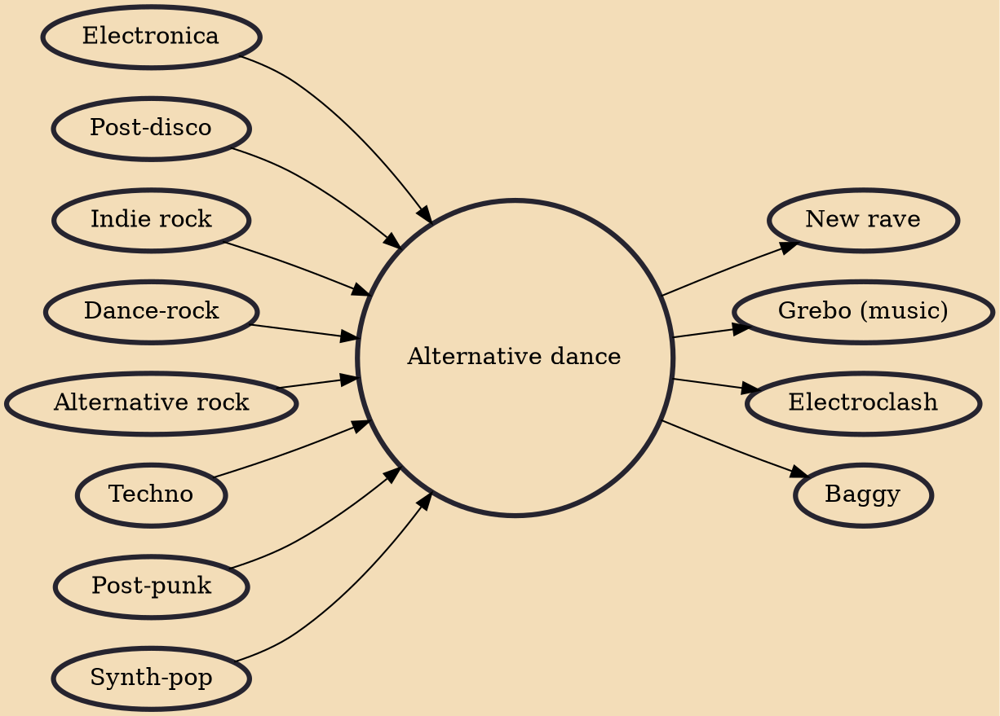

Alternative dance (also known as indie dance or underground dance in the U.S.) is a musical genre that mixes alternative rock with electronic dance music. Although largely confined to the British Isles, it has gained American and worldwide exposure through acts such as New Order in the 1980s and the Prodigy in the 1990s.

## Influences
- [[Electronica]]
- [[Post-disco]]
- [[Indie rock]]
- [[Dance-rock]]
- [[Alternative rock]]
- [[Techno]]
- [[Post-punk]]
- [[Synth-pop]]

## Derivatives
- [[New rave]]
- [[Grebo (music)]]
- [[Electroclash]]
- [[Baggy]]
