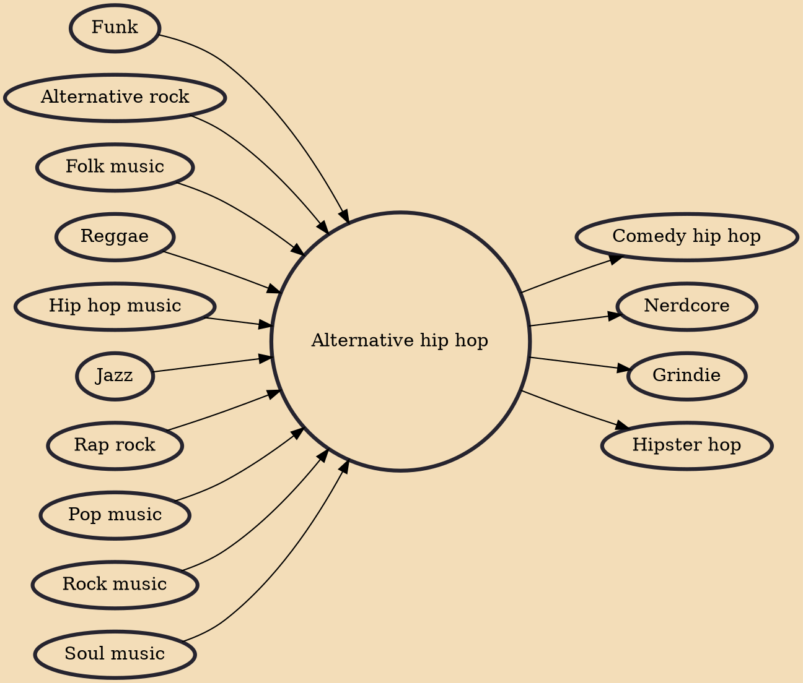

Alternative hip hop (also known as alternative rap) is a subgenre of hip hop music that encompasses a wide range of styles that are not typically identified as mainstream. AllMusic defines it as comprising "hip hop groups that refuse to conform to any of the traditional stereotypes of rap, such as gangsta, bass, hardcore, and party rap. Instead, they blur genres drawing equally from funk and pop/rock, as well as jazz, soul, reggae, and even folk."

## Influences
- [[Funk]]
- [[Alternative rock]]
- [[Folk music]]
- [[Reggae]]
- [[Hip hop music]]
- [[Jazz]]
- [[Rap rock]]
- [[Pop music]]
- [[Rock music]]
- [[Soul music]]

## Derivatives
- [[Comedy hip hop]]
- [[Nerdcore]]
- [[Grindie]]
- [[Hipster hop]]
