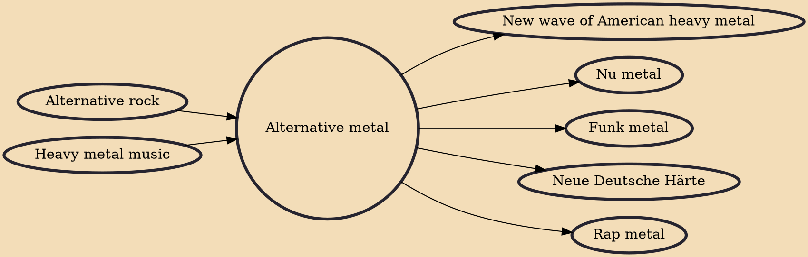

Alternative metal (also known as alt-metal) is a genre of heavy metal music that combines heavy metal with influences from alternative rock and other genres not normally associated with metal. Alternative metal bands are often characterized by heavily downtuned, mid-paced guitar riffs, a mixture of accessible melodic vocals and harsh vocals and sometimes unconventional sounds within other heavy metal styles. The term has been in use since the 1980s, although it came into prominence in the 1990s.

## Influences
- [[Alternative rock]]
- [[Heavy metal music]]

## Derivatives
- [[New wave of American heavy metal]]
- [[Nu metal]]
- [[Funk metal]]
- [[Neue Deutsche Härte]]
- [[Rap metal]]
