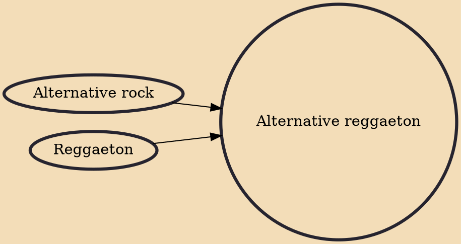

Alternative reggaeton is a subgenre of reggaeton that emerged from the hip hop movement as a reaction to its repetitive and monotone dembow rhythm, and the predominant stereotypical gangsta content that became predictable. The result was a complex sound derived from world sounds, mainly rooted in Latin American folk music such as Puerto Rican bomba y plena, salsa and tango and also other foreign influenced music such as rock en español. Mixed with thoughtful (and sometimes crude) lyricism guided by an anti-colonialism discourse, Latin American sociopolitical content and racial pride, it gave listeners a smooth blend of danceable rhythms and intellectual dialogue.

## Influences
- [[Alternative rock]]
- [[Reggaeton]]
