```dot
digraph {
	graph [bgcolor="#F3DDB8" rankdir=LR]
	node [color="#26242F" penwidth=3.0]
	"Alternative rock" [shape=circle]
	"Punk rock" [URL="/punk-rock/"]
	"Punk rock" -> "Alternative rock"
	"Hardcore punk" [URL="/hardcore-punk/"]
	"Hardcore punk" -> "Alternative rock"
	"Post-punk" [URL="/post-punk/"]
	"Post-punk" -> "Alternative rock"
	Emo [URL="/emo/"]
	"Alternative rock" -> Emo
	"Noise pop" [URL="/noise-pop/"]
	"Alternative rock" -> "Noise pop"
	"Post-punk revival" [URL="/post-punk-revival/"]
	"Alternative rock" -> "Post-punk revival"
	"Indonesian rock" [URL="/indonesian-rock/"]
	"Alternative rock" -> "Indonesian rock"
	"Afro-punk" [URL="/afro-punk/"]
	"Alternative rock" -> "Afro-punk"
	Sadcore [URL="/sadcore/"]
	"Alternative rock" -> Sadcore
	Grunge [URL="/grunge/"]
	"Alternative rock" -> Grunge
	"New wave of new wave" [URL="/new-wave-of-new-wave/"]
	"Alternative rock" -> "New wave of new wave"
	"Cool Cymru" [URL="/cool-cymru/"]
	"Alternative rock" -> "Cool Cymru"
	"Big beat" [URL="/big-beat/"]
	"Alternative rock" -> "Big beat"
	"Nu metal" [URL="/nu-metal/"]
	"Alternative rock" -> "Nu metal"
	"Nagoya kei" [URL="/nagoya-kei/"]
	"Alternative rock" -> "Nagoya kei"
	"Geek rock" [URL="/geek-rock/"]
	"Alternative rock" -> "Geek rock"
	"Indie rock" [URL="/indie-rock/"]
	"Alternative rock" -> "Indie rock"
	"Indie folk" [URL="/indie-folk/"]
	"Alternative rock" -> "Indie folk"
	"Palm Desert Scene" [URL="/palm-desert-scene/"]
	"Alternative rock" -> "Palm Desert Scene"
	"Bangladeshi rock" [URL="/bangladeshi-rock/"]
	"Alternative rock" -> "Bangladeshi rock"
	"Paisley Underground" [URL="/paisley-underground/"]
	"Alternative rock" -> "Paisley Underground"
	"Mangue bit" [URL="/mangue-bit/"]
	"Alternative rock" -> "Mangue bit"
	"Dream pop" [URL="/dream-pop/"]
	"Alternative rock" -> "Dream pop"
	"Alternative country" [URL="/alternative-country/"]
	"Alternative rock" -> "Alternative country"
	"Alternative hip hop" [URL="/alternative-hip-hop/"]
	"Alternative rock" -> "Alternative hip hop"
	"Alternative dance" [URL="/alternative-dance/"]
	"Alternative rock" -> "Alternative dance"
	"Alternative reggaeton" [URL="/alternative-reggaeton/"]
	"Alternative rock" -> "Alternative reggaeton"
	"Alternative metal" [URL="/alternative-metal/"]
	"Alternative rock" -> "Alternative metal"
	"Grebo (music)" [URL="/grebo-music/"]
	"Alternative rock" -> "Grebo (music)"
	"Iranian alternative rock" [URL="/iranian-alternative-rock/"]
	"Alternative rock" -> "Iranian alternative rock"
	"Christian alternative rock" [URL="/christian-alternative-rock/"]
	"Alternative rock" -> "Christian alternative rock"
	"Post-grunge" [URL="/post-grunge/"]
	"Alternative rock" -> "Post-grunge"
	Slowcore [URL="/slowcore/"]
	"Alternative rock" -> Slowcore
	Grindie [URL="/grindie/"]
	"Alternative rock" -> Grindie
	"Riot grrrl" [URL="/riot-grrrl/"]
	"Alternative rock" -> "Riot grrrl"
	Britpop [URL="/britpop/"]
	"Alternative rock" -> Britpop
	"Soft grunge" [URL="/soft-grunge/"]
	"Alternative rock" -> "Soft grunge"
	Skiladiko [URL="/skiladiko/"]
	"Alternative rock" -> Skiladiko
	"Visual kei" [URL="/visual-kei/"]
	"Alternative rock" -> "Visual kei"
	Shoegaze [URL="/shoegaze/"]
	"Alternative rock" -> Shoegaze
	"Time Lord rock" [URL="/time-lord-rock/"]
	"Alternative rock" -> "Time Lord rock"
	"Post-Britpop" [URL="/post-britpop/"]
	"Alternative rock" -> "Post-Britpop"
	"Neo-psychedelia" [URL="/neo-psychedelia/"]
	"Alternative rock" -> "Neo-psychedelia"
}
```

Alternative rock, or alt-rock, is a category of rock music that emerged from the independent music underground of the 1970s and became widely popular in the 1990s. "Alternative" refers to the genre's distinction from mainstream or commercial rock or pop music. The term's original meaning was broader, referring to musicians influenced by the musical style or independent, DIY ethos of late-1970s punk rock.

## Influences
- [[Punk rock]]
- [[Hardcore punk]]
- [[Post-punk]]

## Derivatives
- [[Emo]]
- [[Noise pop]]
- [[Post-punk revival]]
- [[Indonesian rock]]
- [[Afro-punk]]
- [[Sadcore]]
- [[Grunge]]
- [[New wave of new wave]]
- [[Cool Cymru]]
- [[Big beat]]
- [[Nu metal]]
- [[Nagoya kei]]
- [[Geek rock]]
- [[Indie rock]]
- [[Indie folk]]
- [[Palm Desert Scene]]
- [[Bangladeshi rock]]
- [[Paisley Underground]]
- [[Mangue bit]]
- [[Dream pop]]
- [[Alternative country]]
- [[Alternative hip hop]]
- [[Alternative dance]]
- [[Alternative reggaeton]]
- [[Alternative metal]]
- [[Grebo (music)]]
- [[Iranian alternative rock]]
- [[Christian alternative rock]]
- [[Post-grunge]]
- [[Slowcore]]
- [[Grindie]]
- [[Riot grrrl]]
- [[Britpop]]
- [[Soft grunge]]
- [[Skiladiko]]
- [[Visual kei]]
- [[Shoegaze]]
- [[Time Lord rock]]
- [[Post-Britpop]]
- [[Neo-psychedelia]]
