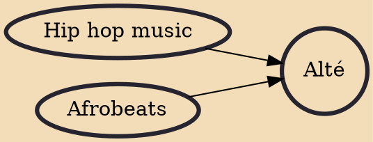

Alté (locally pronounced as "uhl-teh"), is a fusion genre of music that combines elements of afrobeats, dancehall, reggae, hip hop, and alternative R&B. The term was coined in the 2010s by Nigerian music group DRB LasGidi, meaning alternative and "individualistic and non-traditional modes of self-expression" through music and fashion.

## Influences

- [[Hip hop music]]
- [[Afrobeats]]
