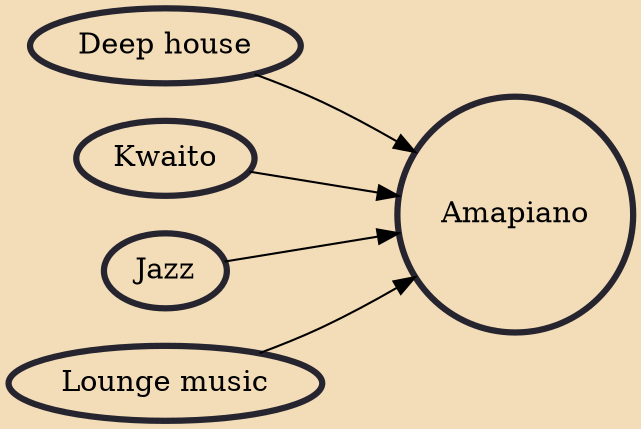

Amapiano (Zulu for "the pianos") is a style of house music that emerged in South Africa in 2012. It is a hybrid of deep house, jazz and lounge music characterized by synths and wide percussive basslines. It is distinguished by high-pitched piano melodies, Kwaito basslines, low tempo 1990s South African house rhythms and percussions from another local subgenre of house known as Tribal house.

## Influences
- [[Deep house]]
- [[Kwaito]]
- [[Jazz]]
- [[Lounge music]]
