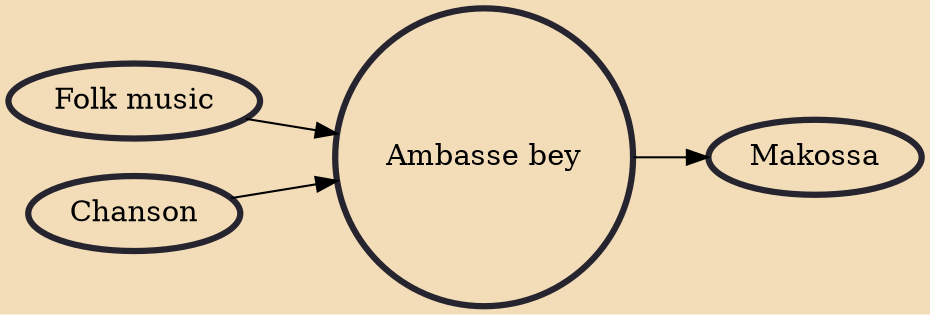

Ambasse bey or ambas-i-bay is a style of folk music and dance from Cameroon. The music is based on commonly available instruments, especially guitar, with percussion provided by sticks and bottles. The music is faster-paced than assiko. John Hall described its rhythm as the one of a moving broom. Where dancers swing their shoulders like the wings of birds, the dance is composed of sequences of fluid steps and jerky body movements performed in accordance with the music, which is generally the makossa. In order to perform this dance, the dancers must wear traditional outfits.

## Influences
- [[Folk music]]
- [[Chanson]]

## Derivatives
- [[Makossa]]
