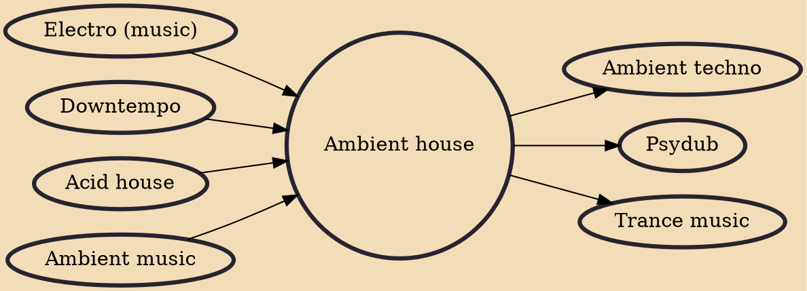

Ambient house is a downtempo subgenre of house music that first emerged in the late 1980s, combining elements of acid house and ambient music. The genre developed in chill-out rooms and specialist clubs as part of the UK's dance music scene. It was most prominently pioneered by the Orb and the KLF, along with artists such as Global Communication, Irresistible Force, Youth, and 808 State. The term was used vaguely, and eventually fell out of favor as more specific subgenres were recognized.

## Influences

- [[Electro (music)]]
- [[Downtempo]]
- [[Acid house]]
- [[Ambient music]]

## Derivatives

- [[Ambient techno]]
- [[Psydub]]
- [[Trance music]]
