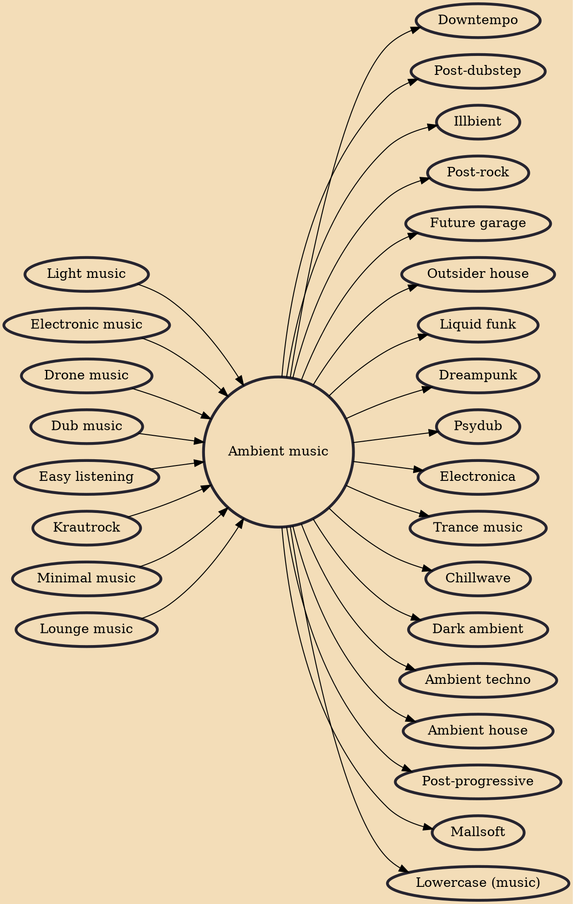

Ambient music is a genre of music that emphasizes tone and atmosphere over traditional musical structure or rhythm. It may lack net composition, beat, or structured melody. It uses textural layers of sound that can reward both passive and active listening and encourage a sense of calm or contemplation. The genre is said to evoke an "atmospheric", "visual", or "unobtrusive" quality. Nature soundscapes may be included, and the sounds of acoustic instruments such as the piano, strings and flute may be emulated through a synthesizer.

## Influences
- [[Light music]]
- [[Electronic music]]
- [[Drone music]]
- [[Dub music]]
- [[Easy listening]]
- [[Krautrock]]
- [[Minimal music]]
- [[Lounge music]]

## Derivatives
- [[Downtempo]]
- [[Post-dubstep]]
- [[Illbient]]
- [[Post-rock]]
- [[Future garage]]
- [[Outsider house]]
- [[Liquid funk]]
- [[Dreampunk]]
- [[Psydub]]
- [[Electronica]]
- [[Trance music]]
- [[Chillwave]]
- [[Dark ambient]]
- [[Ambient techno]]
- [[Ambient house]]
- [[Post-progressive]]
- [[Mallsoft]]
- [[Lowercase (music)]]
