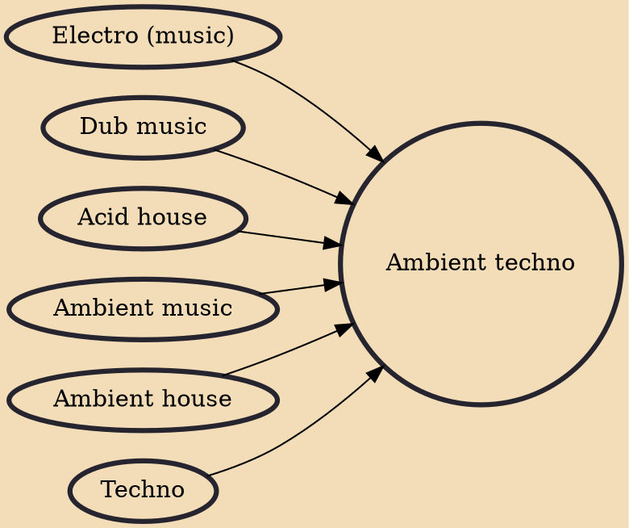

Ambient techno is a subgenre of techno that incorporates the atmospheric textures of ambient music with the rhythmic elements and production of techno. It was pioneered by 1990s electronic artists such as Aphex Twin, Carl Craig, the Black Dog, Pete Namlook and Biosphere.

## Influences
- [[Electro (music)]]
- [[Dub music]]
- [[Acid house]]
- [[Ambient music]]
- [[Ambient house]]
- [[Techno]]
