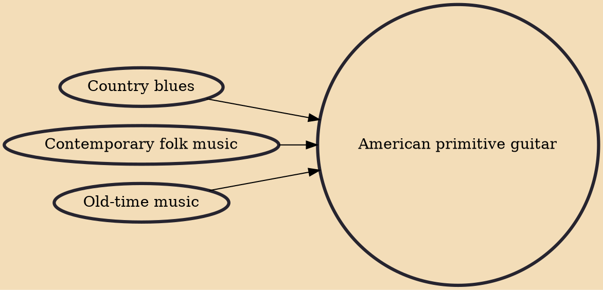

American primitive guitar is a fingerstyle guitar music genre, developed by the American guitarist John Fahey in the late 1950s. While the term "American primitivism" has been used as a name for the genre, American primitive guitar is distinct from the primitivism art movement.

## Influences

- [[Country blues]]
- [[Contemporary folk music]]
- [[Old-time music]]
