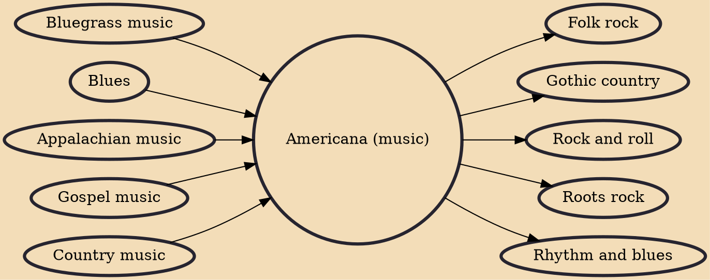

Americana (also known as American roots music) is an amalgam of American music formed by the confluence of the shared and varied traditions that make up the musical ethos of the United States, specifically those sounds that are emerged from the Southern United States such as folk, gospel, blues, country, jazz, rhythm and blues, rock and roll, bluegrass, and other external influences. Americana, as defined by the Americana Music Association (AMA), is "contemporary music that incorporates elements of various American roots music styles, including country, roots-rock, folk, bluegrass, R&B and blues, resulting in a distinctive roots-oriented sound that lives in a world apart from the pure forms of the genres upon which it may draw. While acoustic instruments are often present and vital, Americ

## Influences
- [[Bluegrass music]]
- [[Blues]]
- [[Appalachian music]]
- [[Gospel music]]
- [[Country music]]

## Derivatives
- [[Folk rock]]
- [[Gothic country]]
- [[Rock and roll]]
- [[Roots rock]]
- [[Rhythm and blues]]
