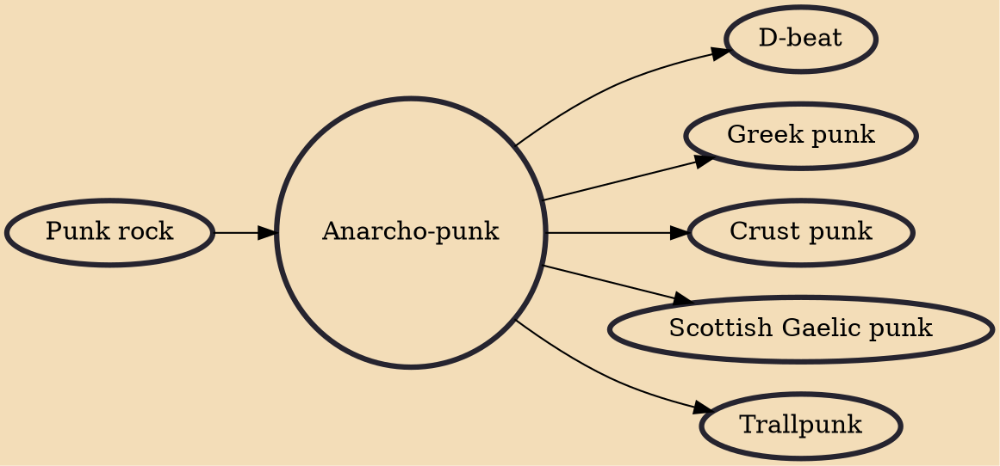

Anarcho-punk (also known as anarchist punk or peace punk) is ideological subgenre of punk rock that promotes anarchism. Some use the term broadly to refer to any punk music with anarchist lyrical content, which may figure in crust punk, hardcore punk, folk punk, and other styles.

## Influences
- [[Punk rock]]

## Derivatives
- [[D-beat]]
- [[Greek punk]]
- [[Crust punk]]
- [[Scottish Gaelic punk]]
- [[Trallpunk]]
