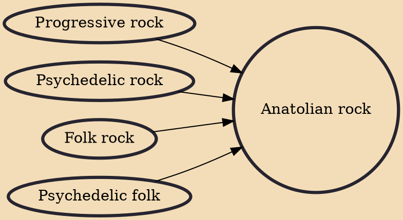

Anatolian rock (Turkish: Anadolu rock), or known as Turkish psychedelic rock, is a fusion of Turkish folk music and rock. It emerged during the mid-1960s, soon after rock groups became popular in Turkey. Most known members of this genre includes Turkish musicians such as Barış Manço, Cem Karaca, Erkin Koray, Selda Bağcan, Fikret Kızılok alongside bands such as Moğollar, Kurtalan Ekspres and 3 Hürel.

## Influences
- [[Progressive rock]]
- [[Psychedelic rock]]
- [[Folk rock]]
- [[Psychedelic folk]]
