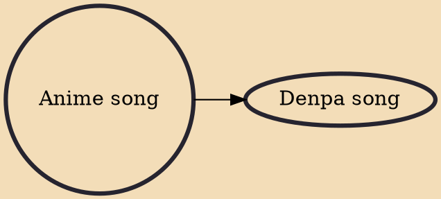

Anime song (アニメソング, anime songu), also shortened to anison (アニソン), is a genre of music originating from Japanese pop music. Anime songs consist of theme, insert, and image songs for anime, video game, and audio drama CD series, as well as any other song released primarily for the anime market, including music from Japanese voice actors.

## Derivatives

- [[Denpa song]]
