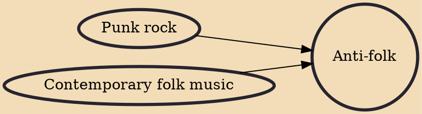

Anti-folk (sometimes referred to as unfolk) is a music genre that emerged in the 1980s in response to the remnants of the 1960s folk music scene. Anti-folk music was made to mock the perceived seriousness of the time's mainstream music scene, and artists have the intention to protest with their mocking and clever lyrics.

## Influences
- [[Punk rock]]
- [[Contemporary folk music]]
