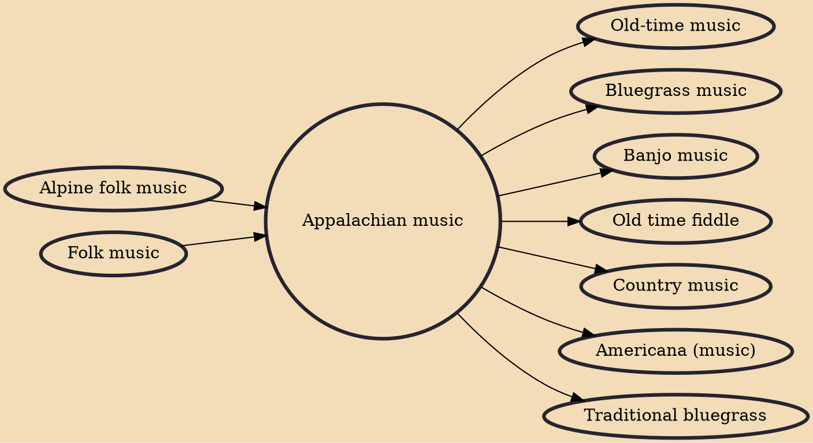

Appalachian music is the music of the region of Appalachia in the Eastern United States. Traditional Appalachian music is derived from various influences, including the ballads, hymns and fiddle music of the British Isles (particularly Scotland), the African music and blues of early African Americans, and to a lesser extent the music of Continental Europe.

## Influences

- [[Alpine folk music]]
- [[Folk music]]

## Derivatives

- [[Old-time music]]
- [[Bluegrass music]]
- [[Banjo music]]
- [[Old time fiddle]]
- [[Country music]]
- [[Americana (music)]]
- [[Traditional bluegrass]]
