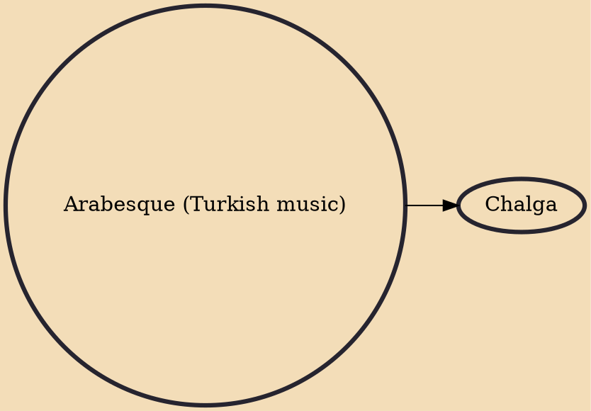

Arabesque (Turkish: Arabesk) is a style of music created in Turkey. The genre was particularly popular in Turkey from the 1960s through the 2000s. Its aesthetics have evolved over the decades. Its melodies are influenced by espesically Arab Music, the music of Southeastern Europe and the Middle East, including bağlama music and Ottoman forms of oriental music. Arabesque music are mostly in a minor key, typically in the Phrygian mode, and themes tend to focus on longing, melancholy, strife and love issues.

## Derivatives
- [[Chalga]]
