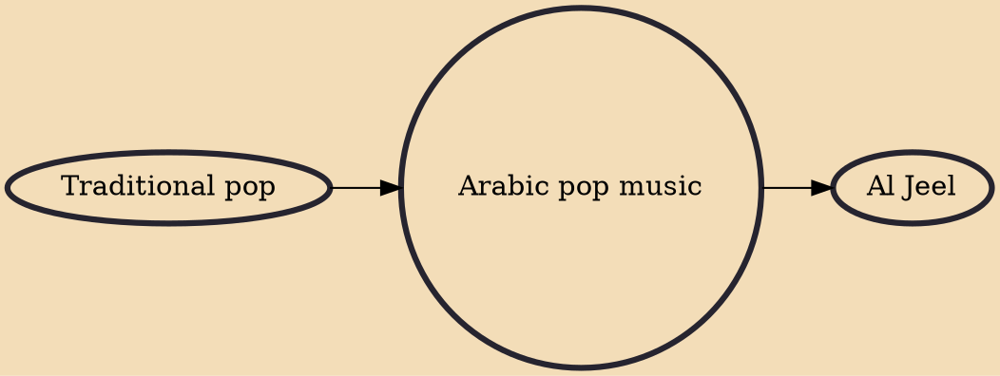

Arabic pop music or Arab pop music is a subgenre of pop music and Arabic music. Arabic pop is mainly produced and originated in Cairo, Egypt; as Egyptian music genre is by far the most widespread within the region.Also Beirut, Lebanon, and Gulf states come as secondary centers. It is an outgrowth of the Arabic film industry (mainly Egyptian movies), also predominantly located in Cairo. Since 2000, various locations in the Gulf countries have been producing Khaleeji pop music.

## Influences
- [[Traditional pop]]

## Derivatives
- [[Al Jeel]]
