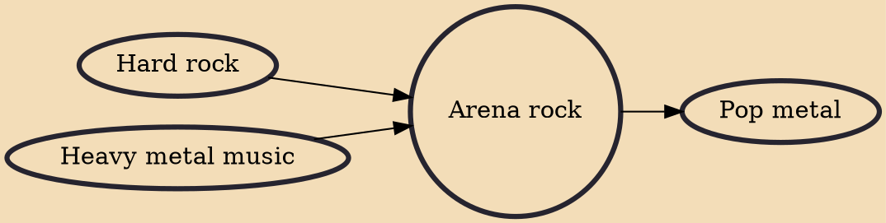

Arena rock (also known as AOR, melodic rock, stadium rock, anthem rock, pomp rock, corporate rock and dad rock) is a style of rock music that originated in the mid-1970s. As hard rock bands and those playing a softer yet strident kind of pop rock became increasingly popular, groups began creating material inherently designed for large audiences, and arena rock developed from their use of more commercially oriented and radio-friendly sounds. The often highly produced music, including both upbeat, dramatic songs and slower power ballads, features strong emphasis on melody and frequently employs anthemic choruses. Other major characteristics include prominent guitar effects and the use of keyboard instruments.

## Influences

- [[Hard rock]]
- [[Heavy metal music]]

## Derivatives

- [[Pop metal]]
