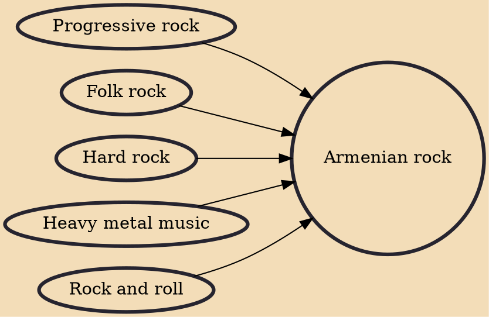

Armenian rock describes a wide variety of forms of rock music made in Armenia or by artists of Armenian descent. Among the most recognized groups of Soviet era were Arthur Meschian's "Arakyalner", "1+2", "Kaleidoscope", and "Bliki". Following the loosening of state control in the early 1980s, a number of Armenian rock bands gained followers in Western Europe, such as and . Asparez was the only Armenian rock act to release an LP on the iconic Soviet label Melodiya. The bands , , and had strong followings at home.

## Influences

- [[Progressive rock]]
- [[Folk rock]]
- [[Hard rock]]
- [[Heavy metal music]]
- [[Rock and roll]]
