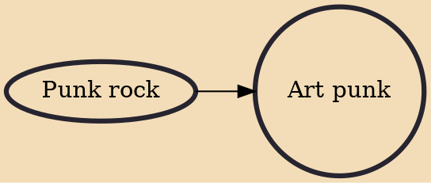

Art punk is a subgenre of punk rock in which artists go beyond the genre's rudimentary garage rock and are considered more sophisticated than their peers. These groups still generated punk's aesthetic of being simple, offensive, and free-spirited, but essentially attracted audiences other than the angry, working-class ones that surrounded pub rock.

## Influences
- [[Punk rock]]
