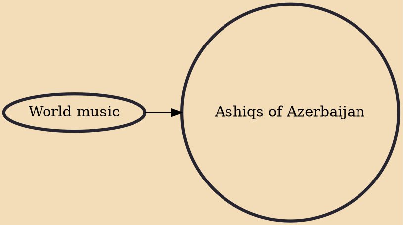

The art of Azerbaijani Ashiqs combines poetry, storytelling, dance, and vocal and instrumental music into traditional performance art. This art is one of the symbols of Azerbaijani culture and considered an emblem of national identity and the guardian of Azerbaijani language, literature and music. Characterized by the accompaniment of the kopuz, a stringed musical instrument, the classical repertoire of Azerbaijani Ashiqs includes 200 songs, 150 literary-musical compositions known as dastans, nearly 2,000 poems, and numerous stories.

## Influences
- [[World music]]
