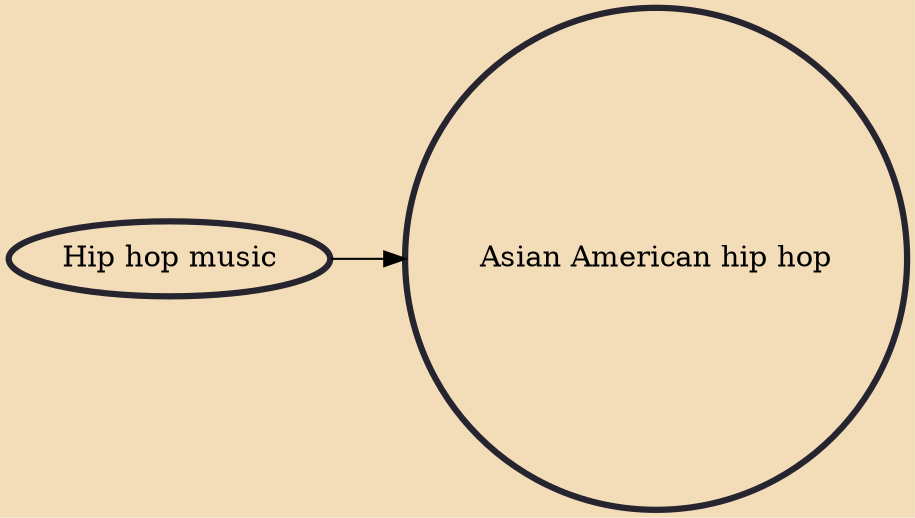

The influence and impact of hip hop was originally shaped from African American and Latino communities in the South Bronx. In the last several decades, the movement has become a worldwide phenomenon which transcends different cultural boundaries as it reaches several ethnic groups, including Asian Americans. Asian American hip-hop practitioners include: MC Jin, Lyrics Born, Dumbfoundead, Tokimonsta, and DJ Q-Bert.

## Influences

- [[Hip hop music]]
