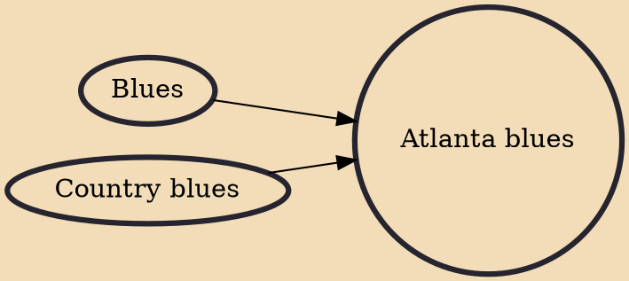

Atlanta blues refers to the local blues scene in Atlanta, Georgia, United States, which had its heyday in the 1920s and 1930s. According to AllMusic,"The Atlanta blues scene of the 1920s was among the most fertile in all the South, with a steady stream of rural musicians converging on the city hoping to gain exposure playing the local club circuit, with any luck rising to perform at Decatur Street's famed 81 Theatre." Many of these musicians banded together into groups; the most popular of these bands were .

## Influences
- [[Blues]]
- [[Country blues]]
