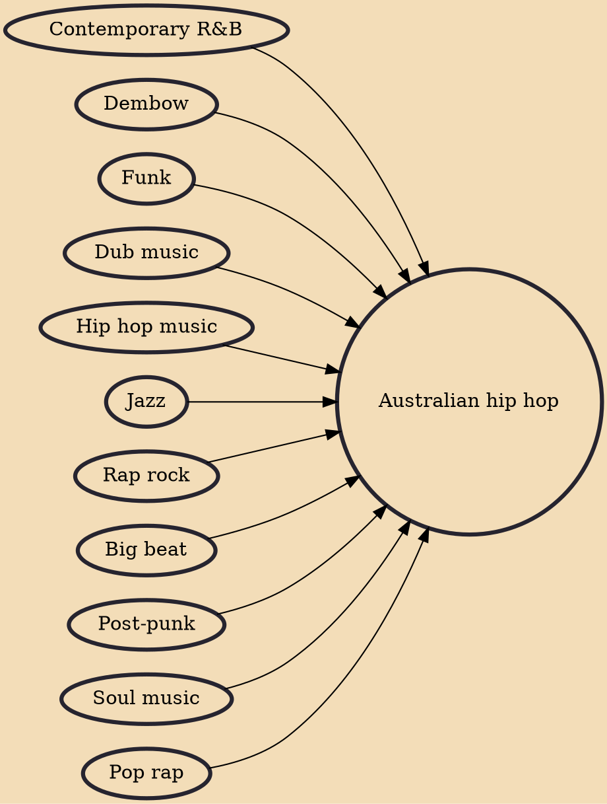

Australian hip hop traces its origins to the early 1980s and is largely inspired by hip hop and other urban musical genres from the United States. As the form matured, Australian hip hop has become a commercially viable style of music which is no longer restricted to the creative underground, with artists such as The Kid LAROI, Manu Crooks, ONEFOUR, Iggy Azalea, Hilltop Hoods, Bliss n Eso and Youngn Lipz, having achieved notable fame. Australian hip hop is still primarily released through independent record labels, which are often owned and operated by the artists themselves. Despite its genesis as an offshoot of American hip hop, Australian hip hop has developed a distinct personality that reflects its evolution as an Australian musical style.

## Influences

- [[Contemporary R&B]]
- [[Dembow]]
- [[Funk]]
- [[Dub music]]
- [[Hip hop music]]
- [[Jazz]]
- [[Rap rock]]
- [[Big beat]]
- [[Post-punk]]
- [[Soul music]]
- [[Pop rap]]
