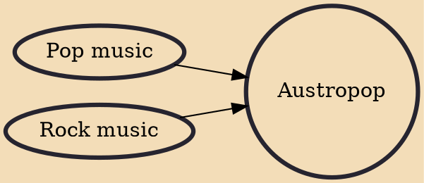

Austropop is pop music from Austria, which came into use in the late 1960s, but had its heyday in the 1970s and early and up until the mid-1980s. Austropop comprises several musical styles, from traditional pop music to rock, and it also sometimes includes traditional folk elements such as yodeling. Neue Deutsche Welle does not count as Austropop, as it was definitely German and the lyrics were in Standard German, while Austropop artists made a distinction by decidedly using Austrian dialects for their lyrics. 
* v 
* t 
* e 
* v 
* t 
* e

## Influences
- [[Pop music]]
- [[Rock music]]
